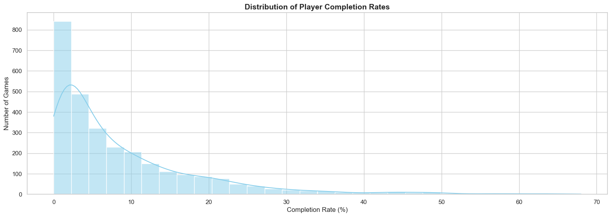
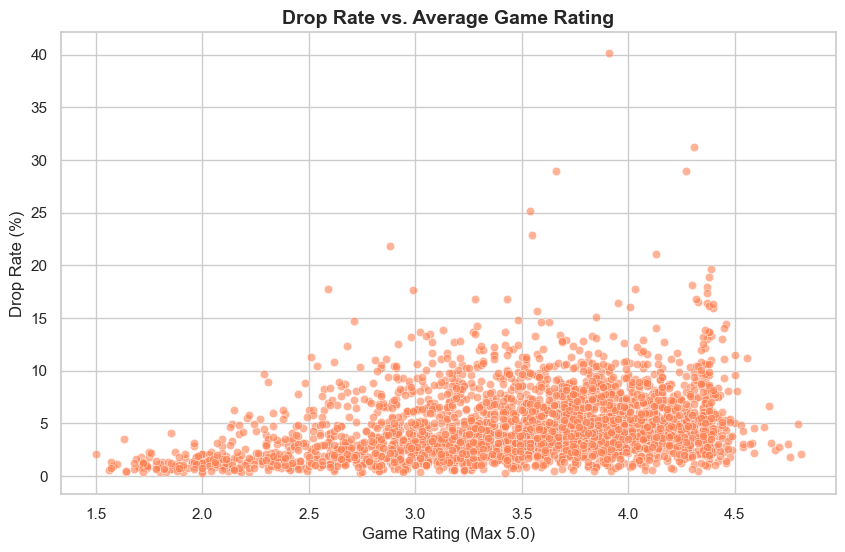
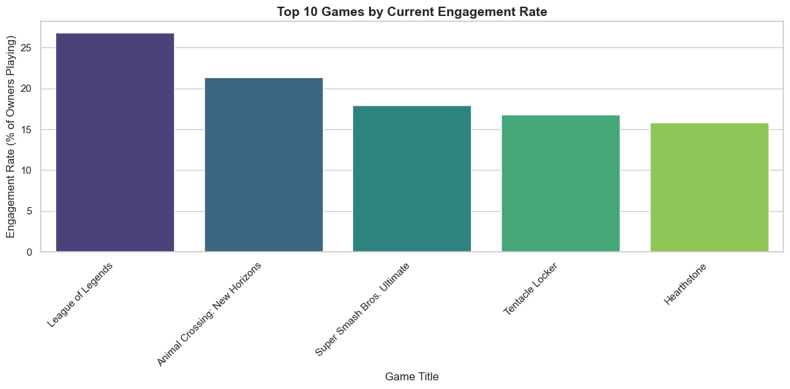

# Player Behavior & Retention Analysis

**Domain:** Gaming Analytics  |  **Project Type:** Exploratory Data Analysis (EDA)  |  **Organization:** PixelForge Analytics *(Fictional)*

---

## Project Overview

This project investigates player behavior patterns across thousands of game titles using data sourced from the RAWG Gaming API. The analysis moves beyond surface-level acquisition metrics to examine what happens *after* a player adds a game to their library — whether they actively play it, complete it, or abandon it entirely.

The findings challenge conventional industry assumptions about ownership as a proxy for success and instead surface behavioral lifecycle metrics that better reflect long-term engagement and product health.

---

## Problem Statement

Game studios routinely make multi-million dollar development and post-launch decisions — from late-game content investment to DLC scoping — based primarily on units sold. However, ownership volume alone reveals little about whether players are genuinely engaged. If the majority of the player base churns within the first few hours, expensive end-game content and narrative expansions may generate limited return on investment.

### Core analytical questions addressed in this project:

* Do most players actually finish the games they add to their libraries?
* Does a higher critical rating meaningfully reduce player drop rates?
* Which titles sustain the highest active engagement relative to their installed base?
* What behavioral patterns emerge from player completion and abandonment trends?

---

## Business Objective

Provide PixelForge Analytics' studio partners with data-backed evidence to:

* Quantify the gap between game ownership and genuine player engagement
* Evaluate whether critical ratings influence retention or simply acquisition
* Surface actionable KPIs — Completion Rate, Drop Rate, and Engagement Rate — that better reflect product health than top-line ownership figures
* Recommend data-informed product and engagement strategies grounded in behavioral analysis

---

## Dataset Information

| Attribute             | Detail                                                                                                                                                              |
| --------------------- | ------------------------------------------------------------------------------------------------------------------------------------------------------------------- |
| **Source**            | RAWG Video Games Database API                                                                                                                                       |
| **File**              | `rawg_api_data.csv`                                                                                                                                                 |
| **Scope**             | Multi-platform game titles with user engagement status data                                                                                                         |
| **Analytical Sample** | Games with 1,000+ library additions (high-volume cohort to reduce statistical noise)                                                                                |
| **Key Raw Features**  | `name`, `rating`, `added`, `added_by_status.beaten`, `added_by_status.dropped`, `added_by_status.playing`, `added_by_status.toplay`, `released`, `esrb_rating.name` |

### Dropped Columns

Metadata and low-variance fields (`slug`, `background_image`, `clip`, `short_screenshots`, `saturated_color`, `dominant_color`, `user_game`, `esrb_rating`, `community_rating`) were removed to streamline the dataset and focus analysis on behaviorally relevant attributes.

---

## Tech Stack

| Layer                 | Tools               |
| --------------------- | ------------------- |
| **Language**          | Python 3            |
| **Data Manipulation** | Pandas, NumPy       |
| **Visualization**     | Matplotlib, Seaborn |
| **Environment**       | Jupyter Notebook    |
| **Data Source**       | RAWG Gaming API     |
| **Version Control**   | Git / GitHub        |

---

## Project Workflow

```text
RAWG API Data Ingestion
        ↓
Data Loading & Schema Inspection
        ↓
Data Cleaning & Type Correction
        ↓
Feature Engineering (Behavioral Rate Metrics)
        ↓
High-Volume Sample Filtering (added > 1,000)
        ↓
Exploratory Data Analysis
        ↓
Business Insights & Strategic Recommendations
```

---

## Data Cleaning & Preparation

The raw dataset required multiple preprocessing steps before analysis:

* **Column Reduction:** Removed metadata and low-value columns to reduce dimensionality.
* **Missing Value Handling:**

  * Records missing `released` dates were removed.
  * Missing engagement status counts were filled with `0`.
  * Missing ESRB values were labeled as `'Not Rated'`.
* **Data Type Correction:**

  * Engagement metrics converted to integer format.
  * `released` converted to datetime format.
* **Deep Copy Workflow:** Transformations applied on a clean working copy (`df_clean`) to preserve the original dataset.

---

## Feature Engineering

Three behavioral metrics were derived using total library additions (`added`) as the denominator:

| Engineered Feature | Formula                   | Business Interpretation                    |
| ------------------ | ------------------------- | ------------------------------------------ |
| `completion_rate`  | `(beaten / added) × 100`  | Percentage of users who finished the game  |
| `drop_rate`        | `(dropped / added) × 100` | Percentage of users who abandoned the game |
| `engagement_rate`  | `(playing / added) × 100` | Percentage of users currently active       |

### Additional Processing

* Rounded all metrics to two decimal places
* Handled division-by-zero edge cases by filling resulting `NaN` values with `0`
* Filtered the dataset to titles with `added > 1,000` for statistical reliability

---

## Exploratory Data Analysis

### 1. Distribution of Player Completion Rates



The completion rate distribution is heavily right-skewed, with most titles clustered below a 10% completion rate. Only a small subset of games achieve strong completion performance.

### Key Insight

The analyzed sample suggests that a large proportion of players do not finish the games they add to their libraries.

---

### 2. Drop Rate vs. Average Game Rating



The scatter plot reveals weak correlation between critical ratings and drop behavior. Several highly-rated games still exhibit substantial abandonment rates.

### Key Insight

Critical acclaim appears to support acquisition more effectively than long-term retention.

---

### 3. Top Games by Engagement Rate



Games with the highest engagement rates tend to share:

* live-service mechanics
* social interaction loops
* competitive gameplay structures
* replayability-focused systems

### Key Insight

Sustained engagement is more strongly associated with gameplay structure and retention design than with review scores alone.

---

## Key Insights

### 1. Ownership Alone Is Misleading

Library additions do not necessarily represent active engagement. High ownership can coexist with low completion and retention rates.

### 2. Early Engagement Is Critical

The largest concentration of churn appears early in the gameplay lifecycle, highlighting the importance of onboarding and early-session experience quality.

### 3. Ratings Do Not Guarantee Retention

Highly-rated games can still experience substantial player abandonment, suggesting retention is influenced more by gameplay design than critical reception.

---

## Business Recommendations

### 1. Prioritize Early Gameplay Experience

Invest heavily in onboarding, pacing, and core gameplay polish during the first few hours to reduce early churn.

### 2. Adopt Retention-Oriented KPIs

Move beyond ownership metrics and track:

* Completion Rate
* Engagement Rate
* Retention Metrics
* Active Player Yield

### 3. Use Behavioral Metrics for Content Planning

Future expansions and DLC investments should align with the actively engaged player base rather than total ownership counts.

### 4. Expand Retention Analysis

Studios should continuously monitor behavioral metrics across genres, platforms, and release periods to identify long-term engagement patterns.

---

## KPIs & Metrics

| KPI                         | Definition                                                  | Relevance                                  |
| --------------------------- | ----------------------------------------------------------- | ------------------------------------------ |
| **Completion Rate**         | % of users who finished the game                            | Measures gameplay completion               |
| **Drop Rate**               | % of users who abandoned the game                           | Early churn indicator                      |
| **Engagement Rate**         | % of users currently playing                                | Active engagement indicator                |
| **Playing-to-Owned Ratio**  | Active players relative to total additions                  | Measures actual active audience            |
| **Rating vs Retention Gap** | Difference between review quality and retention performance | Evaluates acquisition-retention disconnect |

---

## Folder Structure

```text
player-behavior-retention-analysis/
│
├── 01_data/
│   ├── raw/
│   │   └── rawg_api_data.csv
│   │
│   └── processed/
│       └── games_retention_cleaned.csv
│
├── 02_notebooks/
│   └── player_behavior_eda.ipynb
│
├── 03_visuals/
│   ├── completion_rate_distribution.png
│   ├── drop_rate_vs_rating.png
│   └── top_engagement_titles.png
│
├── 04_reports/
│   ├── insights_and_findings.md
│   └── strategic_recommendations.md
│
├── 05_docs/
│   └── project_workflow.md
│
├── requirements.txt
├── README.md
└── .gitignore
```

---

## Challenges & Solutions

| Challenge                                     | Solution                               |
| --------------------------------------------- | -------------------------------------- |
| Division-by-zero during metric calculation    | Filled resulting `NaN` values with `0` |
| Missing engagement counts                     | Imputed missing values with `0`        |
| Metadata columns inflating dataset complexity | Removed non-analytical columns         |
| Highly skewed distributions                   | Used histogram tuning and KDE overlays |

---

## Future Improvements

* Genre-level retention segmentation
* Platform-specific behavioral analysis
* Release-year trend analysis
* Player cohort modeling
* Interactive Power BI dashboard integration

---

## How to Run the Project Locally

### Prerequisites

* Python 3.8+
* Jupyter Notebook

```bash
# Clone the repository
git clone https://github.com/NaveenKumar1822/player-behavior-retention-analysis.git

# Navigate into the project directory
cd player-behavior-retention-analysis

# Install dependencies
pip install pandas numpy matplotlib seaborn jupyter

# Launch Jupyter Notebook
jupyter notebook
```

Open:

```text
02_notebooks/player_behavior_eda.ipynb
```

---

## Conclusion

This project demonstrates that ownership metrics alone are insufficient for understanding true player engagement. Behavioral metrics such as completion rate, drop rate, and active engagement provide deeper visibility into player lifecycle behavior and product health.

The analysis highlights the importance of early-game experience design, retention-focused gameplay systems, and data-driven engagement measurement in modern gaming analytics.

---

## Author

**Naveen Kumar K**
Aspiring Data Analyst | Python · SQL · Power BI

* GitHub: [https://github.com/NaveenKumar1822](https://github.com/NaveenKumar1822)
* LinkedIn: [https://www.linkedin.com/in/naveen-kumar-k-37a638405/](https://www.linkedin.com/in/naveen-kumar-k-37a638405/)

---

*Built as part of a data analytics portfolio project. Data sourced from the RAWG Gaming API. PixelForge Analytics is a fictional studio context used for business framing purposes.*
